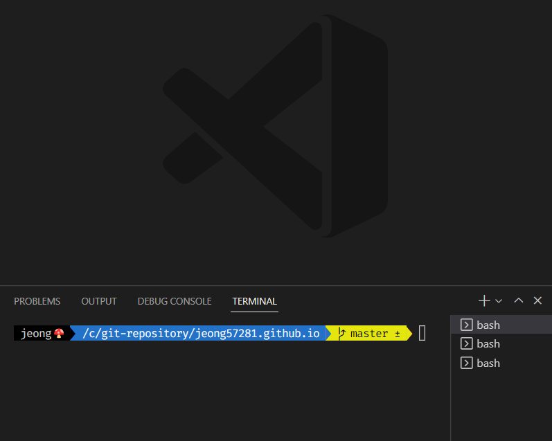
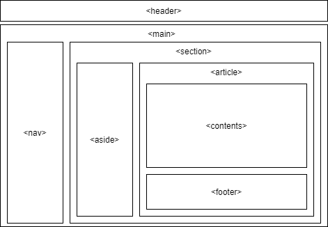
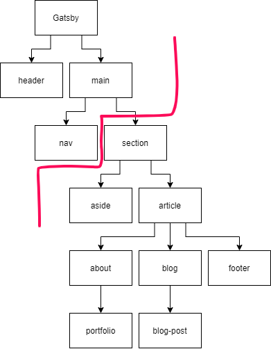
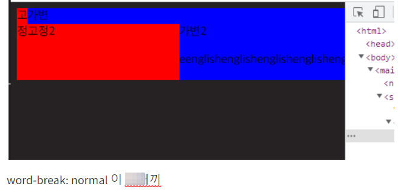

## 들어가는 글

블로그를 완성시키는데 꼬박 열흘이 걸렸다.


빨리 끝내고 싶은 마음에 요일 구분이 안갈 정도로 붙잡고 있었던 것 같다. 전에 사용하던 블로그 템플릿 [devfolio](https://elastic-meninsky-aa7c74.netlify.app/) 과 혁재형의 개인 블로그 [Nagle`s blog](https://hyeokjaelee.github.io/) 를 참고해서 속성으로 개발했는데, 이 두 블로그가 없었다면 밑바닥 부터 시작해서 1~2주는 더 걸리지 않았을까 싶다. (코드의 절반 정도는 혁재형 블로그에서 가져온거라고 해도 할말이 없을 정도로 도움을 많이 받았다.)

## 블로그 제작 동기

1. **데이터 관리** : 지금까지 naver, tistory 블로그에 글을 써왔는데, 쓰면서도 아무리 대형 플랫폼이라지만 게시글 백업을 해둬야 할것만 같고 불안했다. (나만 그런가?)
2. **TOC** : pc 와 모바일 모두 게시글에서 목차를 확인하고 싶었다. velog 는 목차 기능을 지원하지만 일정 크기 이하에서는 목차가 사라져서 보이지 않는다.
3. **포트폴리오로 페이지로 활용** : 블로그의 about 페이지를 포트폴리오 페이지로 활용하고, 포트폴리오에서 전부 담지 못하는 내용들은 같은 웹 페이지의 게시글로 확인할 수 있게끔 하는 아이디어가 좋아 보였다.

## 디자인 작업

디자인에는 자신이 없어서 결과물이 만족스럽게 나오지 않을 것 같아 시작하지 못하고 한참 고민만 하다, 잘 만들어진 웹 페이지를 참고해서 디자인하면 나름 괜찮게 나오겠지 하며 겨우 작업을 시작했다.



요새 항상 켜져있는 vscode 의 디자인이 눈에 띄었다. 배경색에서 명도 차이가 나는 색으로 영역을 구분하거나 강조를 하는 디자인이 마음에 들어 전체 컨셉으로 정했다.

배경색은 다크모드를 고려해서 대비되는 두 색을 [2color](https://2colors.colorion.co) 웹에서 골라 사용했다.

적당히 디자인하고 입체감을 주기 위해 그림자를 이곳저곳에 적용해 보았는데 적당한 선을 찾기 힘들어 아예 모두 제거하고 ui 를 아예 flat 하게 밀고 나가기로 했다.

## React 컴포넌트 설계

### Semantic Elements

난 블로그를 데스크톱 앱 처럼 만들고 싶었기 때문에 헤더 `header` 와 네비게이션바 `nav` 는 항상 화면에 렌더링 되어 있고, 내용이 유동적인 요소들만 나머지 영역 `section` 에서 바뀌게끔 하고 싶어 아래와 같이 설계를 했다.



설계상 footer 는 페이지가 달라질 때 마다 새로 렌더링 되기 때문에, 방문자를 간편하게 체크할 수 있는 [hits](https://hits.seeyoufarm.com) 를 사용할 수 없었다. :unamused:

### Layout

Gatsby 는 정적 사이트 생성기고~ /src/pages 폴더 안의 파일명이 정적 라우팅 역할을 하는구나~ 정도만 알고 블로그 제작을 시작했기 때문에 React 컴포넌트를 설계하고 나서 개발을 하려고 보니, 매번 렌더링 될 필요가 없는 컴포넌트들은 어떻게 처리를 해야하지..? 하며 난감해했다.



layout 플러그인의 존재를 알고 나서야 안심했다. 사진의 빨간 선을 기준으로 위는 항상 렌더링 되어있을 요소, 아래는 url 에 따라 렌더링 될 페이지가 되겠다.

## CSS Troubleshooting

블로그를 만들면서 CSS 가 이렇게 어려운 것인지 몰랐다. 특히 아래 word-break 문제는 CSS 기초지식이 부족했기 때문에 원인 찾기가 정말 어려웠다.

몇개 없지만 해결하기 힘들었던 순서대로 나열해보겠다.

### word-break

텍스트 태그의 word-break 기본 속성값은 normal 이다. normal 은 영어의 경우 줄바꿈이 단어 단위로 일어나게 되는데 이 기본 속성이 문제를 일으켰다.

```css
section {
  display: flex;
  aside {
    width: 300px;
  }
  article {
    width: 100%;
  }
}
```

내 블로그는 **고정 요소**와 **가변 요소**가 함께 사용되기 때문에 `aside` 와 `article` 의 경우 위와 같은 방법을 사용했다.

그랬더니 만약 자식 요소에 줄바꿈이 없는 매우 긴 영어 문자열이 들어올 경우 가로 요소의 너비가 오버플로 되는 것이었다.

display:flex 에 의해 가변 요소가 줄어들었던 것이지 width 는 최대 100% 까지 늘어날 수 있기 때문이였다.

```css
* {
  word-break: break-all;
}
```

break-all 속성을 적용해주면 문제가 해결되지만 영어 가독성이 너무 떨어지게 된다.

```css
article {
  width: calc(100% - 300px);
}
```

calc 를 이용해서 해결했다. (처음부터 calc 를 썻으면 문제가 없었겠지만 width: 100% 이 더 우아해 보여서...)



<p style="text-align:center">(다래끼)</p>

### custom scrollbar transition

```css
::-webkit-scrollbar-thumb {
  background-color: gray;
  transition: background-color ease 0.5;
}
```

커스텀 스크롤바의 내부 속성에는 transition 속성을 적용할 수 없었다.

다크모드를 변경할 때 마다 배경의 색을 0.5초에 걸쳐 부드럽게 전환되도록 애니메이션을 적용해두었는데, 스크롤바만 딱딱하게 변하는 모습은 도저히 지켜볼 수가 없었다.

구글링한 결과 Stack Overflow 에서 상위 요소의 속성을 상속받아 해결할 수 있다고 알려주었다.

```css
background-color: gray;
transition: background-color ease 0.5;
::-webkit-scrollbar-thumb {
  background-color: inherit;
}
```

상위 요소에서도 사용하는 속성일 경우에는 또 다른 방법이 있다.

```css
color: gray;
transition: color ease 0.5;
::-webkit-scrollbar-thumb {
  color: inherit;
  box-shadow: inset 0 0 0 10px;
}
```

## 마무리

참고할 레퍼런스가 든든해서 큰 문제없이 완성시킨 것 같다.

해결했지만 원인을 찾지 못한 CSS 이슈, toc 와 dark mode 구현처럼 제대로 이해하지 못하고 가져와 사용한 코드들은 공부한 후 추가 작성하도록 하겠다.