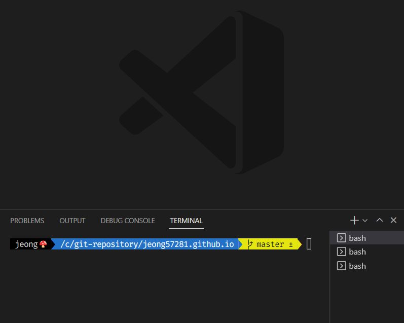
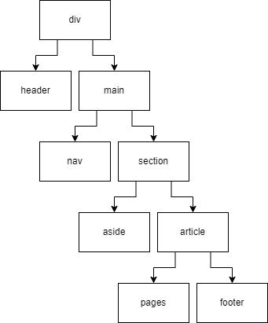
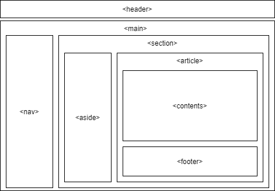
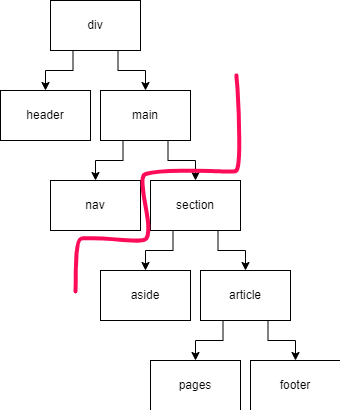
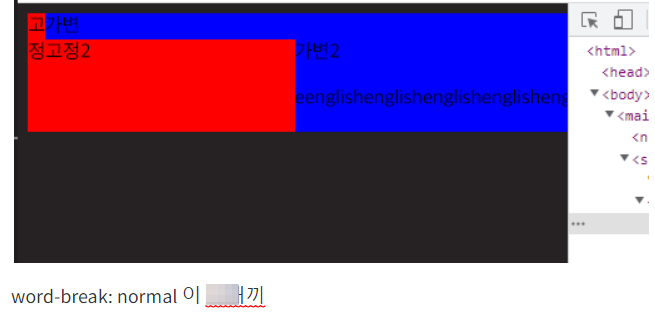

## 들어가는 글

블로그를 완성시키는데 꼬박 열흘이 걸렸다.


빨리 끝내고 싶은 마음에 요일 구분이 안갈 정도로 붙잡고 있었던 것 같다. 전에 사용하던 블로그 템플릿 [devfolio](https://elastic-meninsky-aa7c74.netlify.app/) 와 혁재형의 개인 블로그 [Nagle`s blog](https://hyeokjaelee.github.io/) 를 참고해서 속성으로 개발했는데, 이 두 블로그가 없었다면 밑바닥 부터 시작해서 1~2주는 더 걸리지 않았을까 싶다. (코드의 절반 정도는 혁재형 블로그에서 가져온거라고 해도 할말이 없을 정도로 도움을 많이 받았다.)

## 블로그 제작 동기

1. **데이터 관리** : 지금까지 naver, tistory 블로그에 글을 써왔는데, 쓰면서도 아무리 대형 플랫폼이라지만 게시글 백업을 해둬야 할것만 같고 불안했다. (나만 그런가?)
2. **TOC** : pc 와 모바일 모두 게시글에서 목차를 확인하고 싶었다. velog 는 목차 기능을 지원하지만 일정 크기 이하에서는 목차가 사라져서 보이지 않는다.
3. **포트폴리오로 페이지로 활용** : 블로그의 about 페이지를 포트폴리오 페이지로 활용하고, 포트폴리오에서 전부 담지 못하는 내용은 같은 블로그의 게시글로 확인할 수 있게끔 하는 혁재형 블로그의 아이디어가 좋아 보였다.

## 디자인 작업

컨셉을 잘 잡아야 디자인 하기도 편하고 결과물도 예쁘게 나오는데 아이디어가 떠오르지 않았다.



그러다 눈에 들어온 게 요새 항상 켜져있던 vscode 의 디자인이었다. 배경색에서 명도 차이가 나는 색으로 영역을 구분하거나 강조를 하는 디자인이 마음에 들어 전체 컨셉으로 정했다.

배경색은 다크모드를 고려해서 대비되는 두 색을 [2color](https://2colors.colorion.co) 웹에서 골라 사용했다.

적당히 디자인하고 입체감을 주기 위해 그림자를 이곳저곳에 적용해 보았는데 적당한 선을 찾기 힘들어 아예 모두 제거하고 ui 를 flat 하게 밀고 나가기로 했다.

## React 컴포넌트 설계

난 블로그를 데스크톱 앱 처럼 만들고 싶었기 때문에 헤더 `header` 와 네비게이션바 `nav` 는 항상 화면에 렌더링 되어 있고, 내용이 유동적인 요소들만 나머지 영역 `section` 에서 바뀌게끔 하고 싶어 아래와 같이 설계를 했다.





나중에서야 알게 된 사실인데 설계상 footer 는 페이지가 달라질 때 마다 새로 렌더링 되서, 방문자를 간편하게 체크할 수 있는 [hits](https://hits.seeyoufarm.com) 를 사용할 수 없었다. :unamused:

### gatsby-plugin-layout

Gatsby 는 정적 사이트 생성기고~ /src/pages 폴더 안의 파일명이 정적 라우팅 역할을 하는구나~ 정도만 아는 상태로 블로그 제작을 시작했기 때문에 React 컴포넌트를 설계하고 나서 개발을 하려고 보니, 매번 렌더링 될 필요가 없는 컴포넌트는 어떻게 처리를 해야할지 몰라 난감했다.



다행히 layout 플러그인의 존재를 알고 나서야 안심했다. 사진의 빨간 선을 기준으로 위는 항상 렌더링 되어있을 요소, 아래는 url 에 따라 렌더링 될 페이지가 되겠다.

### custom-layout

개발을 하다보니 페이지마다 중복 사용되는 html element 패턴이 보여 재사용 할 레이아웃을 하나 만들었다.

1. 스크롤이 가능하도록 높이를 제한한다.
2. 반응형 크기 조절을 위해 최대 너비를 지정한다.
3. 항목이 없을 때에도 footer 가 보이지 않도록 최소 높이를 지정한다.
4. padding

```html{5,9}:title=content-layout.jsx
<div className={style.layout} id="scroll">
  <div className={style.maxWidth}>
    <div className={style.minHeight}>
      <div className={style.padding}>
        {children}
      </div>
    </div>
  </div>
  <Footer data={data}/>
</div>
```

```html:title=pages.jsx
<ContentLayout>
  <!-- 내용 -->
</ContentLayout>
```

항상 footer 와 함께 스크롤 되어야하는 내용 `contents` 들을 만든 레이아웃으로 감싸 사용한다.

## CSS Troubleshooting

블로그를 만들며 필요할 때 마다 구글에서 고민없이 가져다 쓰던 CSS 때문에 엄청 고생했다. 특히 **word-break** 속성 때문에 생긴 문제는 원인 찾기가 정말 어려웠다.

> 줄어들지 않는 width

```scss:title=.scss
section {
  width: 100%;
  display: flex;
  aside {
    width: 300px;
  }
  article {
    width: 100%;
  }
}
```

내 블로그는 고정 요소 `aside` 와 가변 요소 `article` 가 함께 가로로 정렬되어야 한다. 구글에서 위와 같은 방법을 찾아 사용했다.

문제는 `article` 자식으로 매우 긴 문자열이 들어오니 윈도우 크기가 줄어들어도 따라 변하질 않았다. 별거 아닐 줄 알았던 문제가 두 시간 넘게 크기를 조절하면서 붙잡아도 이유을 알 수가 없어서, 결국 다시 하나씩 만들어보며 원인을 찾기 시작했다.



<p style="text-align:center">(다래끼)</p>

범인은 텍스트 태그 word-break 속성의 default 값 normal 이었다. normal 은 영어의 경우 줄바꿈이 단어 단위로 일어나기 때문에 띄어쓰기가 없으면 줄바꿈이 일이나지 않아 너비가 줄어들지 않는다.

그런데 왜 overflow 되지 않고 부모 요소도 함께 늘어날까;;

또 다시 윈도우 크기를 늘리고 줄이면서 이유를 찾아봤는데, 특정 크기에 다다르면 너비가 줄어들지 않는 것을 발견했다. 그 특정 크기는 부모 요소의 너비와 같았다.

즉, `article` 의 width: 100% 는 flexible box 인 `section` 에 의해 줄어들었던 것이었고, 늘어날 수 있는 최대 너비 100% 에 고정 요소 `aside` 의 크기까지 더해 부모의 가로 크기를 넘어섰던 것이었다.

> 해결 방법

```css:title=.css
article {
  width: calc(100% - 300px);
}
```

break-all 속성을 주어 글자 단위로 줄바꿈되도록 하는 방법은 영어 가독성이 너무 떨어지기 때문에 calc 를 이용해서 해결했다. (처음부터 calc 를 쓰지 않은 이유? width: 100% 이 더 우아해 보여서...)

## 마무리

참고할 레퍼런스가 든든해서 큰 문제없이 완성시킬 수 있었지만, 그만큼 깊게 공부하지 않고 가져다 쓴 코드도 많아서 추가적인 공부가 더 필요할 것 같다.

사용하면서 버그수정, 최적화 작업을 계속해나가다 보니 점점 줄어들어 이젠 거의 다 끝낸 것 같아 뿌듯했는데, 생각해보니깐 아직 seo 를 위한 작업이 남아있었다. :cry: