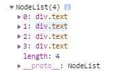

> 필요할 때 참고해서 쓰되, 알고 사용하자는 의미에서 정리까지 함.
<br/>

# global

## parseInt

```
parseInt( string, base )
```

* `string` : 10진수로 변환할 문자열
* `base` (option) : string 진수의 밑수 (string 이 2진법 문자열일 경우 2)

base 를 생략할 경우 default 값으로 string 진수의 밑수가 초기화 된다. (default 값이 10이 아님에 유의)

### - 진법 변환 N to 10

```js
parseInt('0110', 2); // 6
```

(`string` 을 `base` 진법으로 변환한다 는 의미가 아닌데, 자꾸만 `base` 에 10을 사용하는 실수를 한다.)

### - 소수점 버림

```js
parseInt(15.4) // 15
```

# Array

## sort

```
Array.sort( function( a, b ) )
```

* `callback` (option) : 비교함수
  * `a`, `b` : 비교중인 두 값

callback 함수를 생략하면 **문자열**로 변환한 후 비교하여 유니코드의 코드 포인트를 기준으로 오름차순 정렬된다. (정수 배열을 정렬할 때 기본이 오름차순 정렬이라고 해서 callback 함수 없이 사용하면 엉망으로 정렬된다.)

callback 함수가 주어진 경우 반환한 값을 3가지로 나누어 처리한다.

1. 0보다 작은 값 : a가 b앞에 온다.
2. 0 : 아무것도 하지 않는다.
3. 0보다 큰 값 : b가 a앞에 온다.

### - 단일 요소 정렬

```js
const arr = [2, 1, 3, 10];
const compare = (a, b) => {
  if(a < b) return -1;
  else return 1;
}
arr.sort(); // 1, 10, 2, 3
arr.sort(compare); // 1, 2, 3, 10
arr.sort((a, b) => a-b); // 1, 2, 3, 10
```

a-b 는 a가 b보다 작을 때에만 음수가 반환되기 때문에 오름차순으로 정렬된다.

### - 다중 요소 정렬

```js{4}
const arr = [[2, 5], [1, 2], [3, 8], [10, 1], [2, 9]];
const compare = (a, b) => {
  if(a[0] < b[0]) return -1;
  else if (a[0] > b[0]) return 1;
  else {
    if(a[1] > b[1]) return -1;
    else return 1;
  }
}
console.log(arr.sort(compare));
// [ [ 1, 2 ], [ 2, 9 ], [ 2, 5 ], [ 3, 8 ], [ 10, 1 ] ]
```

요소 배열의 첫 번째 원소는 오름차순으로, 두 번째 원소는 내림차순으로 정렬했다.

(a, b 가 **같을 때** 두 번째 요소를 이용해서 비교를 해줘야 하는데, 강조한 라인을 빼먹고 자꾸만 **크거나 같을 때** 로 조건문을 짜는 코딩 실수를 한다.)

## from

```
Array.from( arrayLike, mapFn, thisArg )
```

* `arrayLike` : 새로운 배열로 변환하고자 하는 순회 가능한 객체
* `mapFn` (option) : 배열의 모든 요소에 대해 호출할 매핑 함수
* `thisArg` (option) : mapFn 실행 시 this 로 사용할 값

배열 문자열 와 같은 객체 뿐만 아니라, length 를 가지는 유사 배열 객체<sup id="rfn_1">[[1]](#fn_1)</sup>와 Map, Set 등 순회 가능한 객체도 사용이 가능하다.

### - 중복 원소 제거

```js
console.log(Array.from(new Set([1,1,2,2,2,3,4]))); // [1, 2, 3, 4]
```

Set 생성자를 이용해 중복 제거를 원하는 배열을 집합 객체로 만들고 Array.from 메서드를 사용해 다시 새로운 객체로 변환한다.

### - 다차원 배열 생성

```js
const arr = Array.from(Array(5), () => Array(5).fill(0));
/*
[
  [ 0, 0, 0, 0, 0 ],
  [ 0, 0, 0, 0, 0 ],
  [ 0, 0, 0, 0, 0 ],
  [ 0, 0, 0, 0, 0 ],
  [ 0, 0, 0, 0, 0 ]
]
*/
```

`arrayLike` 에 주어진 배열의 모든 원소는 `mapFn` 를 거쳐 배열 원소로 바뀐다.

## map

```
Array.map( callback( currentValue, index, array ), thisArg)
```

* `callback` : 새로운 배열 값을 만들어내는 함수
  * `currentValue` : 요소 값
  * `index` (option) : 요소 인덱스
  * `array` (option) : 호출한 배열
* `thisArg` (option) : callback 함수에서 this 로 사용할 값

```js
const arr = ['1', '2', '3', '4', '5'];
const res = arr.map((currentValue, index, array) => {
  console.log(currentValue); // 1, 2
  if(index === 0) array.splice(2, 3);
  return Number(currentValue);
});
console.log(res); // [ 1, 2, <3 empty items> ]
console.log(res.length); // 5
```

callback 함수 내에서 원본 배열의 값이 삭제되었을 경우, 삭제된 요소를 방문하지 않으며 결과 배열에는 빈 값이 자리를 대체하게 된다.

### - string 배열을 정수 number 배열로 변경하기

```js
const arr = ['1', '2', '3', '4', '5'];
arr.map(Number); // [1, 2, 3, 4, 5]
```

원시 래퍼 객체 [Number 의 생성자 함수](#number)를 callback 함수로 전달해 배열의 모든 string 요소를 number 배열로 변경한다.

만약 같은 결과를 얻기 위해 parseInt 함수를 callback 으로 전달해주면 전혀 다른 배열을 돌려받는다. 이유는 map 은 callback 함수에 3개의 매개인자를 전달하는데, [parseInt](#parseint) 의 두 번째 옵션 매개인자인 `base` 로 index 값이 전달되기 때문이다.

## forEach

```
Array.forEach( callback( currentValue, index, array ), thisArg )
```

* `callback` : 배열의 값을 순차적으로 전달받음
  * `currentValue` : 요소 값
  * `index` (option) : 요소 인덱스
  * `array` (option) : 호출한 배열
* `thisArg` (option) : callback 함수에서 this 로 사용할 값

\- thisArg 는 this 값을 가지지 않는 화살표 함수나, callback 함수에 직접 this 를 bind 하는 것으로 대체할 수 있다. <br/>
\- forEach 는 undefined 를 반환하므로 메서드 체인의 중간에 사용할 수 없다. <br/>
\- 예외를 발생시키지 않고서는 중간에 멈출 수 없다.

## slice

```
Array.slice( begin, end )
```

* `begin` (option) : 잘라 낼 시작 인덱스
* `end` (option) : 잘라 낼 마지막 인덱스 `+1`

\- for 문에서 조건문에 등호를 보편적으로 쓰지 않는 것 처럼 end 값은 인덱스에 포함되지 않는다.</br>
\- end 생략 시 배열의 끝까지 잘라낸다. Array.length 가 들어간다고 생각하면 된다. </br>
\- begin 마저 주어지지 않거나 undefined 값이 들어올 경우 0부터 추출한다. </br>
\- begin 이 Array.length 보다 크거나 같을 경우 빈 배열을 반환한다.

|arr|1|2|3|4|5|
|-|-|-|-|-|-|
|음수 인덱스|-5|-4|-3|-2|-1|
|양수 인덱스|0|1|2|3|4|

음수 인덱스 사용도 가능하다.

## reduce

```
Array.reduce( callback ( accumulator, currentValue, currentIndex, array ), initalValue )
```

* `callback`
  * `accumulator` : 누적값
  * `currentValue` : 요소 값
  * `currentIndex` (option) : 요소 인덱스
  * `array` (option) : 호출한 배열
* `initalValue` (option) : accumulator 의 초기값 (제공하지 않으면 배열의 첫 번째 요소 사용)

callback 함수는 4가지 인자를 받고, 반환 값을 accumulator 에 누적한다. 최종적으로 reduce 함수는 accumulator 를 반환한다.

### - 총합 구하기

```js
const arr = [1, 2, 3, 4];
arr.reduce((s, c) => s+c, 0); // 10
```

# String

## slice

[Array.slice()](#slice) 와 사용법이 같다.

## fromCharCode

```
String.fromCharCode( num1, ..., numN )
```

* `numN` (option) : UTF-16 코드 값 (0~65535)

매개인자가 여러개가 들어올 수 있으며, 각각의 변경된 문자는 하나의 문자열로 반환된다.

### - 코드값 문자로 변경

```js
String.fromCharCode(0x41, 0x61); // Aa
```

## charCodeAt

```
String.charCodeAt( index )
```

* `index` : code 로 변경하려는 문자열의 index 값

\- **숫자가 아닌 값**이 들어오면 0 을 사용한다. (아무런 값도 입력하지 않으면 undefined 가 들어가는 것 같다.)<br/>
\- 범위 밖의 index 를 입력했을 경우 NaN 를 반환한다.

### - 문자 코드값으로 변경

```js
'abc'.charCodeAt().toString(16) // 61
'ABC'.charCodeAt(0).toString(16) // 41
'ABC'.charCodeAt(3).toString(16) // NaN
```

## toLowerCase, toUpperCase

```
String.toLowerCase()
String.toUpperCase()
```

문자열을 전부 소문자, 대문자로 변경해준다.

```js
String.prototype.toUpperCase.call(true); // TRUE
```

toUpperCase 의 this 가 `undefined`, `null`, `문자열` 이 아닌 값이 사용될 경우 모두 대문자로 변환해 반환한다고 한다. (이런식으로 사용할 경우가 있을까?)

### - 대소문자 변경

위에 설명되어 있음.

## padStart

```
String.padStart( targetLength, padString )
```

* `targetLength` : 목표 문자열 길이
* `padString` (option) : 채워 넣을 문자열

\- 항상 왼쪽부터 채워 나간다.<br/>
\- targetLength 보다 문자열이 길다면 그대로 반환한다.<br/>
\- padString 에 아무런 값도 주어지지 않으면 공백이 사용된다.<br/>
\- padString 이 목표 문자열 길이를 넘어서면 잘려 채워진다.

### - 문자열 자릿수 맞추기

```js
'0110'.padStart(8);    // "    0110"
'0110'.padStart(8, 0); // "00001110"
```

# Number

```
Number( value )
```

* `value` : number 타입으로 변환할 값

`Number` 원시 래퍼 객체를 함수 형태로 사용할 경우 number 타입으로 형변환 할 수 있다.

```js
console.log(Number('0x4a'), Number('4a')); // 74 NaN
```

`0x` 를 붙이지 않은 16진수 문자열이 들어올 경우의 출력이다.

위와 같이 문자열로 변환할 수 없는 값이 들어올 경우 `NaN` 를 반환한다.

## toString

```
Number.toString( base )
```

* `base` (option) : 변환할 진수의 밑수 (2진법의 경우 2)

base 생략 시 10진수로 가정한다.

### - 진법 변환 10 to N

```js
const num = 7;
num.toString(2); // 111
```

## toFixed

```
Number.toFixed( digit )
```

* `digit` (option) : 소수점 자릿수 (default: 0)

\- 소수점 digit 자리까지 반올림하여 string 으로 반환한다.<br/>
\- 음수의 경우는 number 로 반환한다.<br/>
\- 소수점 이하 자리수가 digit 보다 작을 경우 0으로 채운다.

### - 소수점 반올림

```js
15.4123651.toFixed(4); // 15.4124 (type: string)
-15.4123651.toFixed(4); // -15.4124 (type: number)
```

### - 소수점 자리수 채우기

```js
15.41.toFixed(8); // 15.41000000 (type: string)
-15.41.toFixed(8); // -15.41000000 (type: number)
```

# Object

### - 객체 속성 삭제

```js
const obj = { 'Jeju': 1, 'Pangyo': 2 };
delete obj['Jeju']; // { 'Pangyo': 2 }
delete obj.Pangyo; // {}
```

* `delete` : 성공적으로 삭제됬거나 없는 속성을 삭제하려하면 true 를, 삭제하지 못했다면 false 를 반환한다.

## keys, values, entries

```
Object.keys( object )
Object.values( object )
Object.entries( object )
```

* `keys` : key 로 구성된 배열을 반환한다.
* `values` : value 로 구성된 배열을 반환한다.
* `entries` : \[key, value\] 쌍의 배열로 구성된 배열을 반환한다.

배열의 순서는 for-in 루프의 순서와 같다.

### - 객체 속성 개수 구하기

```js
const obj = { 'Jeju': 1, 'Pangyo': 2 };
Object.keys(obj).length; // 2
```

## hasOwnProperty

```
Object.hasOwnProperty( prop )
```

* `prop` : 속성명 확인

### - 객체 속성값 존재 확인

```js{7,8}
const obj = { 'Jeju': 1, 'Pangyo': 2 };
obj.hasOwnProperty('Jeju') // true
obj.hasOwnProperty('prop') // false

const _obj = { 'hasOwnProperty': () => 0, 'Jeju': 1, 'Pangyo': 2 };
_obj.hasOwnProperty('Jeju'); // 0
({}).hasOwnProperty.call(_obj, 'Pangyo') // true
Object.prototype.hasOwnProperty.call(_obj, 'prop'); // false
```

만약 속성에 hasOwnProperty 이름의 value 를 함수를 가지는 속성이 존재해도 경고를 일으키지 않는다.

`_obj` 의 경우 hasOwnProperty 를 사용하려면 강조한 두 방법을 사용하면 된다.

# RegExp

(정규 표현식 전용 게시글로 새로 쓰기 귀찮으니깐 여기에 정규식 사용법까지 정리함.)

정규 표현식 RegExp 는 **Reg**ular **Exp**ression 의 약자이며, 패턴을 이용해 문자열을 처리하는데 사용된다.


정규 표현식은 두 개의 슬래시 `/` 와 패턴 그리고 플래그로 구성되어 있다.


먼저 패턴에 들어올 수 있는 문자의 종류이다.

|패턴|의미|
|-|-|
|*, {0,}|\*, {0,}앞에 오는 문자가 0개 이상 일치한다.|
|+, {1,}|\+, {1,}앞에 오는 문자가 1개 이상 일치한다.|
|{n, m}|앞에 오는 문자가 n번 이상 m번 이하로 일치한다.|
|^|패턴이 ^뒤에 오는 문자로 시작한다.|
|$|패턴이 $앞에 오는 문자로 끝난다.|
|?|패턴 중 ?앞에 오는 문자가 없거나 하나가 일치한다.|
|.|패턴 중 .앞에 오는 문자가 정확히 하나가 일치한다.|
|x\|y|x 또는 y 중 하나가 일치한다.|
|\[xyz\]|x, y, x 중 하나가 일치한다.|
|\(xy\)|포획 괄호, 괄호 안의 문자열을 하나의 단위로 취급하며 대응된 문자열을 기억하는 효과를 갖는다.|
|\\|패턴에 들어올 수 있는 의미있는 문자를 패턴으로 사용하기 위한 이스케이핑 문자|


다음은 flag 에 들어올 수 있는 옵션의 종류이다.

|플래그|의미|
|-|-|
|i|ignore case, 대소문자를 구별하지 않고 검색|
|g|global, 문자열 내의 모든 패턴을 검색|
|m|multi line, 문자열의 행이 바뀌더라도 검색|

flag 는 옵션이므로 값을 주지 않으면 패턴이 여러개더라도 첫 번째 패턴을 찾으면 종료하게 된다.

## \[Symbol.split\]

```
RegExp[Symbol.split]( str )
String.split( RegExp ) // 같은 결과
```

* `str` : 분리할 문자열

String 객체의 split 메서드에 정규 표현식 객체를 넣어줄 경우 내부적으로 RegExp 객체의 \[Symbol.split\] 메서드가 호출이 된다.

### - 패턴을 포함한 문자열 분리

```js
const regexp = new RegExp(/([A-Z]{1}#?)/g);
const res = regexp[Symbol.split]('CC#BCC#BCC#BCC#B').filter(el => el !== '');
console.log(res);
// [ 'C', 'C#', 'B', 'C', 'C#', 'B', 'C', 'C#', 'B', 'C', 'C#', 'B' ]
```

## test

```
RegExp.test( str )
```

* `str` : 정규 표현식이 일치하는 부분이 있는지 확인할 문자열

일치하는 부분이 있으면 true, 없으면 false 를 반환한다.

```js
const obj = [ 'a', 'b', 'c', 'd' ];
const regexp = new RegExp(/[a-z]/g);
const res = [];
obj.forEach(el => res.push(regexp.test(el)));
console.log(res); // [ true, false, true, false ]
```

만약 전역 탐색 플래그 `g` 가 주어진다면 false 를 반환할 때 까지 `lastIndex` 가 계속해서 증가하므로, 다른 문자열로 재사용했을 때 문제가 될 수 있다.

# JSON

## parse

```
JSON.parse( text, reviver )
```

* `text` : JSON 으로 변환할 문자열
* `reviver` (option) : 분석한 값을 반환하기 전에 변환한다.
  * `key` : 속성의 키 값 (배열일 경우 인덱스)
  * `value` : 속성의 값

`text` 에 후행 쉼표가 오면 SyntaxError 가 발생한다.

```js
const jsonStr = '{"Jeju":1,"Pangyo":2,"Ssangyong":"house"}';
console.log(JSON.parse(jsonStr, (key, value) => {
  if(typeof value === 'number') return value+1;
  return value;
})); // { Jeju: 2, Pangyo: 3, Ssangyong: 'house' }
```

속성 값이 number 일 경우 1을 더해주는 reviver 함수

## stringify

```
JSON.stringify( value, replacer, space )
```

* `value` : JSON 문자열로 변환할 값
* `replacer(function)` (option) : undefined 를 반환할 경우 해당 속성이 포함되지 않는다.
  * `key` : 속성의 키 값 (배열일 경우 인덱스)
  * `value` : 속성의 값 
* `replacer(array)` (option) : JSON 문자열 결과에 key 가 array 안에 존재하는 속성만 포함된다.
* `space` (option) : 들여쓰기 space 개수

string(문자열) + ify(~되게끔 만들다) = stringify, 문자열이 되게끔 만들다.

```js
const obj = {
  'Jeju': 1,
  'Pangyo': 2,
  'Cheonan': {
    'Ssangyong': 'house'
  },
  'func': () => {},
  'undefined': undefined,
  'symbol': [ Symbol(''), 3 ]
};
console.log(JSON.stringify(obj, (key, value) => {
  console.log(key, value);
  if(typeof value === 'number') return undefined;
  return value;
})); // "{"Cheonan":{"Ssangyong":"house"},"symbol":[null,null]}"
```

`function` 과 같이 열거 불가능한 속성은 무시된다. 만약 배열 안에 있을 경우 null 로 변환된다.

```js
const obj = { 'Jeju': 1, 'Pangyo': 2 };
JSON.stringify(obj, (key, value) => undefined); // undefined
```

만약 모든 요소를 제거하기 위해 항상 undefined 를 반환한다면 비어 있는 객체가 아닌 undefined 가 반환된다. 왜냐하면 함수형 replacer 는 첫 호출에 **key** 로 빈 문자열 `''`, **value** 로 `value` 가 들어오기 때문이다.

### - 깊은 복사

```js
const obj = { 'Jeju': 1, 'Pangyo': 2 };

const _obj = JSON.parse(JSON.stringify(obj));
const __obj = obj;

console.log(obj === _obj); // false
console.log(obj === __obj); // true
```

깊은 복사는 **주소 값**이 아닌 **실제 값**을 복사하는 것을 의미한다.

JSON.stringify() 는 string 원시 타입 `실제 값` 으로 만들어 반환하므로, 이를 JSON.parse() 로 객체로 만들면 완전히 새로운 객체로 만들 수 있다.

# 각주

<a id="fn_1" href="#rfn_1">[1] </a>배열처럼 보이지만 key 가 숫자이고 length 값을 가지고 있는 객체를 말한다. 예를 들면 `document.querySelectorAll()` 로 가져온 `NodeList` 객체가 있다.


# Reference

* [MDN web docs](https://developer.mozilla.org/ko)
* [생활코딩](https://opentutorials.org/course/743)
* [poiemaweb](https://poiemaweb.com/)