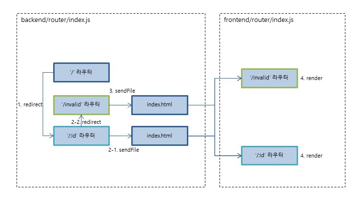
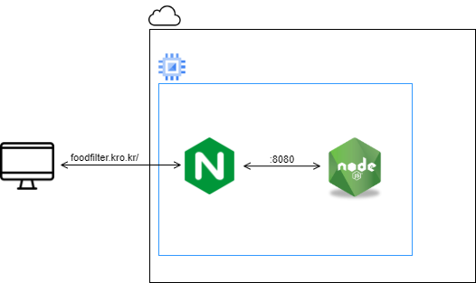
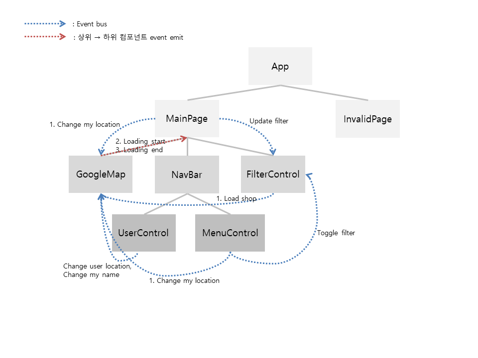
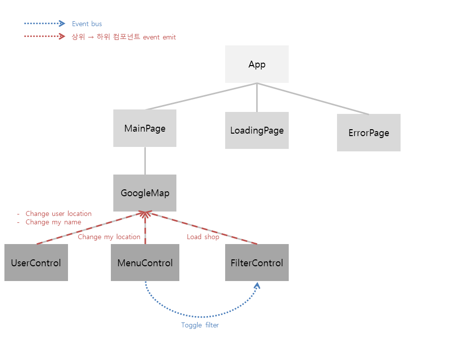
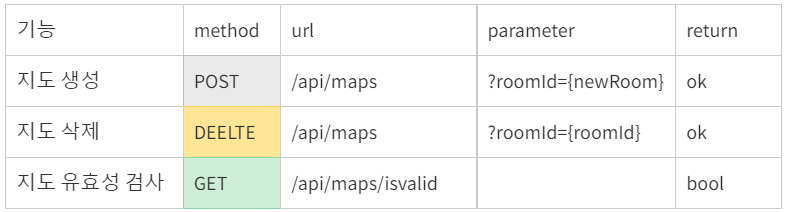
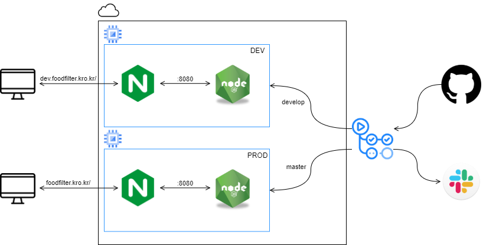

4학년 1학기 ~ 여름학기 동안 [food filter 웹 프로젝트](https://jeong57281.github.io/post/food-filter)를 진행했었다. 2학기가 다가올 때 쯤 웹 서비스가 동작이 되는 수준까지는 완료가 되었다 생각하고, 새학기에 할 다른 프로젝트를 기획하고 있었다.

새로운 프로젝트 주제를 선정하고 구현에 필요한 자료들을 조사하다 [taggle](https://github.com/woowacourse-teams/2020-taggle) 이라는 프로젝트를 알게 되었는데, 내 프로젝트 구조와는 많이 달랐고 다른 프로젝트를 하기보단 기존의 프로젝트를 뜯어고쳐야겠다는 생각이 들게 되었다.

## WAS 와 Web Server 분리



이전 food filter 의 프로젝트 구조이다.

서버가 동적 처리와 정적 파일 제공을 모두 하고 있다.

url 주소가 이동 될 때 마다 vue-router 에 의해 정해둔 컴포넌트가 잘 렌더링 되고 있지만, 화면이 바뀔 때 마다 index.html 를 전부 불러오고 있어 spa 의 장점을 전혀 살리지 못하고 있다.

정적과 동적 처리를 나누고 프론트엔드 프레임워크가 제 기능을 하도록 하기 위해 Web Server 와 WAS 를 분리할 필요가 있었다.

### NGINX

vue 로 build 된 index.html 을 제공할 web server 로 nginx 를 선택했다.

비동기 처리 방식인 nginx 는 reverse proxy 기능을 제공하는데 다음과 같은 장점이 있었다.

* 서버 ip 를 숨겨 보안을 높일 수 있다.
* 로드 밸런서로 WAS 의 부하를 줄일 수 있다.



`/api` 와 `/socket` 으로 들어오는 모든 요청은 WAS 로 reverse proxing 해 주었고, api 서버의 응답결과에 따라 `$router` 객체를 이용하여 상태를 유지하며 페이지를 이동시켜 주었다.

## Vue 컴포넌트 구조 수정



처음 뷰 프레임워크를 이용하여 설계했을 때는 컴포넌트를 최대한 작게 쪼갤수록 좋다는 조언에 따라, 될 수 있는대로 나누다 보니 이벤트 버스가 무분별하게 사용되었고 나중에는 설계도를 보아도 어떻게 작동하는지 잘 알아볼 수 가 없었다.

그래서 이벤트 버스 사용을 줄이고 props 와 event emit 을 이용한 상하위 부모-자식 간의 통신으로 최대한 해결하도록 다시 설계했다.



컴포넌트 위치를 재조정하므로써 이벤트 버스를 줄일 수 있었는데 전혀 사용하지 않을 순 없었다.

## 협업을 위한 개발 환경 

food filter 프로젝트는 사실상 개발자가 나 혼자인 개인 웹 앱 프로젝트였기 때문에 꾸준히 git 을 이용한 형상관리만 할 뿐, 협업을 위한 프로젝트 구조에 대해서는 신경써보지 않았다.

그런데 최근 프로젝트 리팩토링을 하며 프론트엔드와 백엔드 개발의 범위가 명확해지면서, 협업을 하게 되면 어떻게 개발이 이루어지는지 궁금해졌다.

그래서 프론트와 백엔드를 따로 개발하는 것 처럼 상황을 가정한 후 개발 환경을 구성해보았다.

### API 설계



백엔드 개발이 아무것도 이루어지지 않은 상태에서는 테스트를 해볼 수 없기에 프론트엔드에서는 미리 함께 설계해둔 api 에 따라 mock 서버 혹은 파일을 만들고 테스트한다.

### Dev Server Proxy

api 개발이 진행되면 테스트해볼 수 있도록 서버에 배포한다. 프론트엔드 개발자는 dev server proxy 를 설정해, 요청이 서버가 배포되어있는 주소로 proxing 되도록하고 host 를 제외한 path 만을 이용해 http 요청한다. (실제 서버에 배포가 되면 현재 url 로 요청이 전송되고 `/api` 요청의 경우 nginx 에서 이를 reverse proxing 한다.)

```js
// 예시
axios.get('/api/maps', {
})
.then((res) => {
})
.catch((err) => {
})
```

### CI/CD

CI/CD 툴로 사용하기 편리한 git actions 을 사용하였는데

* **CI(Continuous Integration) 지속적 통합** : 개발자가 나 혼자라 겪어볼 수 없었다.
* **CD(Continuous Delivery & Deployment) 지속적 전달 & 배포** : 배포를 자동화하고 slack 으로 알림이 가도록 설정했다.

project/
<br/>┝ frontend/
<br/>┕ Backend/


이 때 관리와 자동 배포를 위해서 위와 같은 폴더를 각각의 레포지토리로 나누어야 했다.

### 서버

서비스를 만들 때 하나의 서버에서 개발, 운영 모두 이루어지는게 아녔다. (지금 생각해보면 당연한 이야기지만)

크게 개발, 스테이징, 운영 서버가 있는데 스테이징을 제외한 두개의 서버만 사용하고 있다. 

### 완성된 배포 플로우



개발 서버에는 `develop` branch 에서 커밋이 push 될 때 마다 배포가 이루어지고, 운영 서버에는 `master` branch 에 `develop` branch 가 pr 되어 merge 될 때 마다 배포가 되도록 했다.

## 마무리

리팩토링 과정에서 코드 최적화를 하며 생긴 오류들은 프로젝트에 여러 기능을 추가하고 난 후 작성할 게시글에 쓰도록 하겠다.