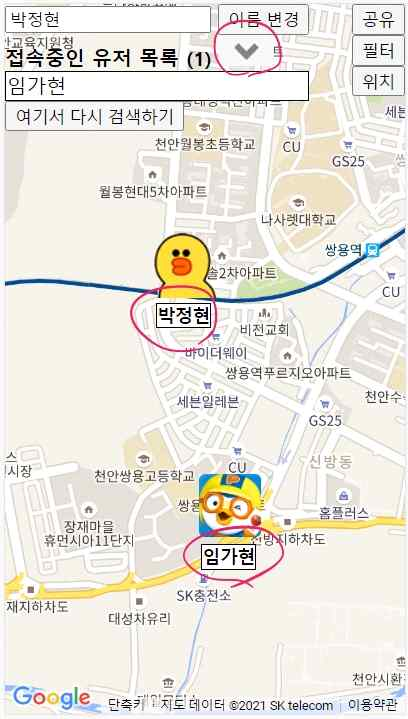

## ~프로젝트가 결정되기 까지

평소 친구를 만나거나 중고거래를 할 때 낯선 장소라면 쉽게 서로를 발견하지 못하고 헤매게 되는 불편함을 겪곤 했다.

그래서 **모바일 gps 를 이용한 위치공유 웹 서비스**를 개발해 보고 싶다는 생각을 종종 해왔는데, 4학년 1학기 캡스톤 디자인 과목을 수강하면서 SPA 와 Routing 개념을 알게 되었고 아이디어를 구현할 수 있을 것 같았다.

마침 진행 중이던 학교 스터디그룹 지원 사업에 참여해 토이 프로젝트로 얼른 만들어보고자 디자인과 친구를 한 명 꼬셔왔다.

그렇게 공부하며 기능구현만 하면 될 줄 알았지만 혹시나 하는 마음에 구글링을 해보니 내 아이디어와 동일한 프로젝트가 존재했다.

...

스터디그룹 신청서는 제출했고 승인도 받았는데 아이디어가 없었다. 

개발자랑 디자이너 이렇게 둘이 협업한다는 의미에서 '교집합' 이라고 이름도 지어 지원해놨는데 말이다^^

그래도 계속해서 서로의 위치를 공유하면서 이용할 수 있는 다른 서비스가 있는지 곰곰이 생각해보았다.

당시 스터디그룹 외에 다른 자율 스터디도 병행하고 있었는데 인원이 5~6명 정도 되었다. 공부를 마치고 함께 저녁을 먹으러 가기 전 식사 메뉴를 결정해야 했는데 그날따라 서로 불호하는 메뉴가 많았고 다 같이 만족스런 식당을 고르기가 힘들었다.

이때 든 생각이 같이 식사를 하는 사람들끼리 한 지도 화면을 보면서 본인이 먹고 싶은 메뉴, 먹기 싫은 메뉴를 골라 하나로 합친다면 모두가 먹고 싶어 하는 음식을 파는 식당을 검색할 수 있지 않을까 싶었다.

구현하기도 어렵지 않을 것 같고 교집합이라는 그룹 이름과도 어울려 이미 존재하는지 확인한 후 최종 프로젝트 주제로 결정하게 되었다.

## 기획 단계

서비스에 어떤 기능이 들어가야 하는지 어떻게 작동할지에 대한 과정을 상의하며 그림을 그려보았더니 생각보다 많이 간단했다.

그리고 모바일을 대상으로 하는 웹 서비스기 때문에 화면 안에 들어가야 할 요소도 적어 전체적인 테마 컨셉만 결정하면 되었고 제플린과 같은 협업 툴은 사용할 필요가 없을 거라 판단했다.

## 개발 시작!

하지만 막상 기능을 구현하려 하니 막막했다. 디자인을 떠나 작동이 되게끔 만들어야 하기 때문에 어떤 기술 스택이 필요한지부터 조사해야 했다.

일단 스터디그룹의 지원금 20만원 중 일부를 'Node.js 교과서' 를 구매했다.

책에는 socket.io 를 이용한 채팅 앱 만드는 예제가 있었는데 이걸 응용하면 서비스를 구현하기에 충분하다고 생각했고, 프론트엔드 프레임워크까지는 배울 시간이 충분치 않았기에 최종적으로 선정된 기술 스택은

`Node.js` `Socket.io` `Express.js` `VanillaJS`

가 되었다.

### Backend

처음 떠올렸고 이미 존재했던 **위치공유 웹 서비스** 프로젝트는 서버에 접속하면 새로운 지도 url 를 만들어 공유한 뒤 사용하는 방식이었는데, 나는 그 과정도 번거롭다고 생각이 들어 접속하면 자동으로 새로운 url 주소를 생성하여 redirect 되도록 설계했다.

 
또, 같은 화면을 공유하는 사용자 간의 데이터 관리가 필요했는데 너무 일회성인 데이터고 서버가 종료되어 소멸되도 문제가 없을 작은 데이터였기 때문에 데이터베이스 대신 서버의 전역 변수를 사용했다.

### 지도 api 선정

처음엔 카카오 maps api 를 이용하려 했는데 공식 문서를 읽는 능력이 부족했던 탓인지 특정 지역을 기준으로 장소를 찾는 메서드가 없는 줄 알고, 구글의 nearBySearch 메서드를 이용하기 위해 구글 maps api 를 선택했는데 지금 와서 보니 너무나 쉽게 찾을 수 있었다.

### 디자인

스타일이 입혀지지 않은 화면에서 기능 구현만 하려니 성격상 눈이 즐겁지 못하면 의욕이 줄어드는 편이라 참지 못하고 디자인 작업부터 먼저 진행해버렸다.

### 배포

여러 번의 테스트를 거친 뒤 gcp 에 배포했는데 문제가 하나 있었다.

서버의 운영을 위해 pm2 패키지를 사용했는데 멀티 프로세싱으로 인해 socket.io 에 문제가 생기는 것이었다.

해결책으로 서버를 백그라운드로만 실행시켜주는 forever 패키지를 사용하였더니 문제가 없었다.

## 마무리

스터디그룹이 끝나고 프로젝트를 조금 더 보완하기 위해 `Vue.js` 를 이용해서 프론트를 수정했다.

수정하면서 프론트엔드 프레임워크가 왜 필요한지에 대해 뼈저리게 느끼며 신선한 충격을 받았다.

학기 중에 진행되었던 스터디그룹이 끝날 무렵 각자의 바쁜 일정으로 인해 프로젝트에 신경을 쓰기가 어려워 완성도를 높이지 못한게 아쉽다. 앞으로 여러 사람들에게 만든 서비스를 보여주면서 받은 피드백과 함께 프로젝트를 계속해서 개선해 나갈 생각이다.