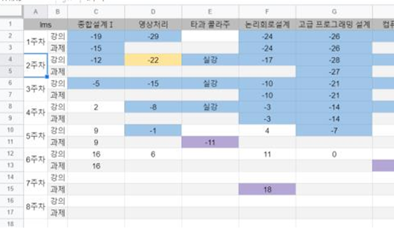
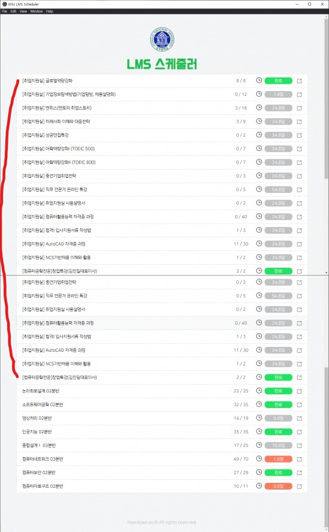
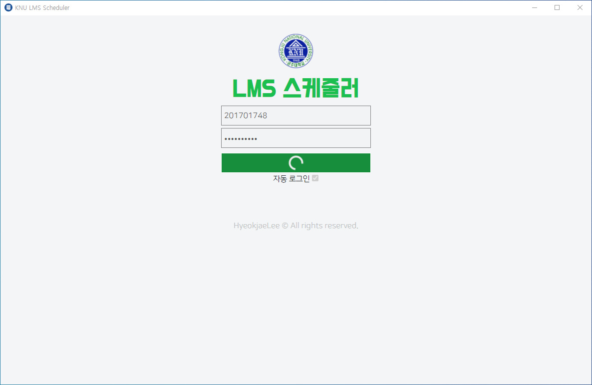
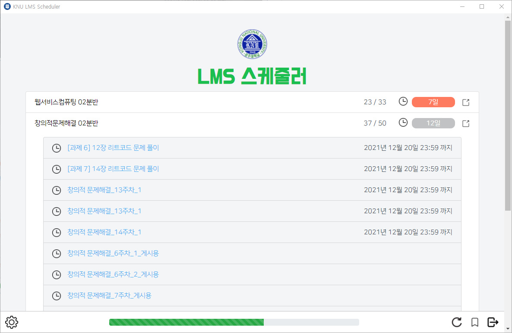
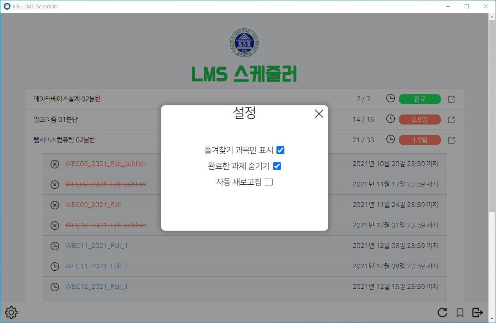

## 개발 동기

4학년으로 복학했을 때 코로나가 한창이라 모든 수업이 비대면으로 진행되고 있었다.

온라인 강의다 보니 실시간 수업이 아니면 녹화강의나 과제를 잊어버리는 경우가 많아 구글 시트에 정리해가며 일정을 관리했지만 보기도 힘들고 일일이 입력하는것도 귀찮았다.

그렇게 불편한 상태로 OT 주가 지나고 수업이 본격적으로 진행될 때 쯤 캡스톤 디자인 과목에서 조별 프로젝트를 하게 되었는데, 주제 회의에서 불편했던 LMS 시스템에 대한 이야기가 나오자 모두가 공감했고 모든 과목의 수업과 과제를 한 화면에서 확인할 수 있도록 하는 프로그램을 만들기로 결정되었다.

## 개발 과정 

조 인원은 나를 포함하여 셋이었다. 개발을 위한 회의가 진행되자 3년동안 학교를 다녀오면서 생전 처음 듣는 어려운 용어들이 막 나오고 어지러웠다.

운좋게 조를 잘 만나서 프로젝트 완성에 대한 걱정은 하지 않아도 되었지만, 많은 회의감이 들어 프로젝트를 이해하기 위해 열심히 공부해야 했다.

회의를 하며 사용하게 될 프레임워크에 대해 듣게 되었는데 선정된 도구들이 어떤 이유로 정해지게 되었는지 정리해보겠다.

### 개발 도구

* `Puppeteer` : LMS 에 로그인하여 학생마다 다른 과목 정보를 크롤링해와야 하므로 브라우저를 핸들링 하기 위한 스크래핑 라이브러리
* `Electron` : 크롤링에 개인 컴퓨터 자원을 이용하도록 하기 위해 설치형 애플리케이션 제작 프레임워크
* `React` : 혁재형이 빠르게 개발할 수 있는 프론트 프레임워크(?)

### Frontend

많은 부분을 혁재형이 빠르게 제작해 둔 상태라 기능 추가 위주로 개발에 참여했다.

제작중인 프로젝트는 크롤링도 원활히 되고 데이터도 보기좋게 가공되어 있었는데 한 가지 불편한 점이 있었다.

공주대학교 LMS 시스템에는 수강신청한 과목 뿐만 아니라 취업지원실에서 운영하는 과목도 추가적으로 수강할 수 있는데, 과목을 크롤링 해오는 페이지에 이 둘을 구분할 데이터가 없어 중요하지 않은 과목들까지 모두 크롤링되어 온다는 것이었다.

어떻게 하면 필요한 과목만 볼 수 있을까 생각하다 과목 즐겨찾기가 생각났다. 즐겨찾기 정보를 다른 페이지에서 받아오고 즐겨찾기에 등록된 과목들만 크롤링 해오도록 필터링하면 될 것 같았다.

물론 당시에는 어떻게 구현해야 할 지 몰라 모두 불러온 후 해당되는 과목들만 화면에서 숨기는 방법을 사용했다.

## 마무리

내가 추가한 기능까지만 해도 편리하게 사용하기에는 충분했다. 완성된 프로젝트가 학교 사람들에게 배포가 되고 유용하게 사용할 때 제작에 참여한 사람으로써 뿌듯함도 느낄 수 있었다.

하지만 실제로 프로젝트를 진행하며 내가 한 건 기획과 하나의 기능을 추가한 것 밖에 없다.

그래서 학기가 끝난 후 사용된 모든 기술 스택에 대해 공부하고 나만의 버전을 만들어 보았다.

### 기능 추가

* 로그아웃
* 완료과제 감추기
* 자동 새로고침 on/off

### 최적화

* useEffect 를 이용한 ipc 수신부 최적화
* 메모리 누수로 인한 프로그램 종료를 막기 위해 여러개의 조각으로 나누어 병렬 크롤링하도록 수정