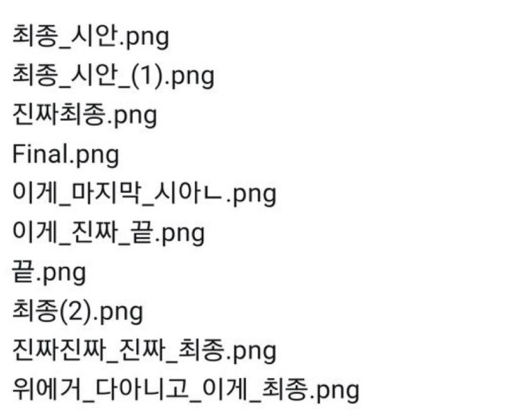
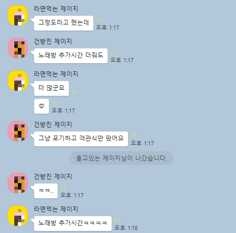
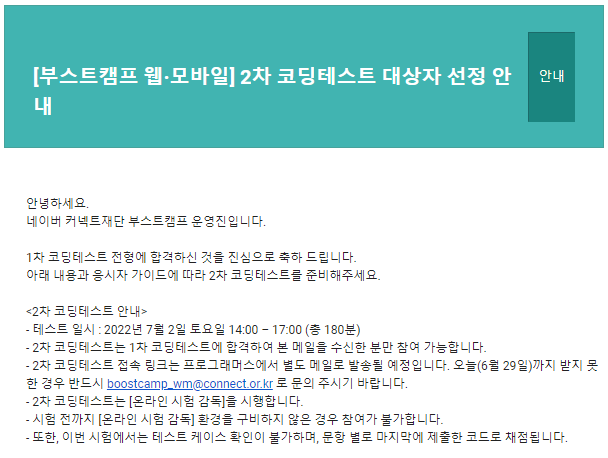
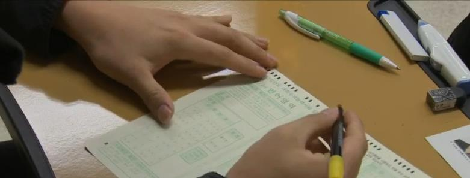
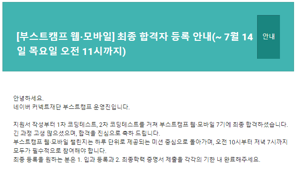
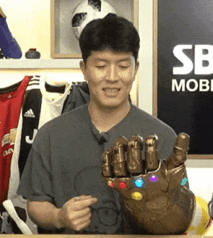

## 서류 접수

네이버 부스트캠프 웹·모바일 7기 서류지원 마감일은 6/21 이었다. 서류에는 문항에 쓰인 내용을 뒷받침 할 웹 페이지 링크나 pdf 를 추가로 받고 있었고, 이 기회에 항상 만들어봐야지 생각만하고 미뤄왔던 포트폴리오 겸 기슬 블로그를 개발해 제출하기로 했다.

지원까지 약 3주의 시간이 있었는데, 내 계획은 2주 안에 블로그를 완벽하게 완성시키고 남은 1주일은 자소서 작성에만 몰입하는 것이었다.

기술 블로그는 평소에 만들어보고 싶었던 것이기에 힘든줄도 모르고 신나게 개발하다 보니 계획대로 2주안에 블로그를 완성시켰다. 하지만 문제는 "이제는 완벽하다!" 싶으면 나타나는 오류들이었다.

사소한거라도 한번 눈에 띄면 고치지 않고서는 못참는 성격이라 남은 1주일 동안에도 자소서에 쓰기로 한 시간까지 쪼개가며 블로그 수정을 했는데 이게 맞나 싶었다.

그래도 다행인건 지원 서류의 4문항 모두 400자 이내라 큰 부담없이 쓰고 제출할 수 있었다. (그래도 난 자소서 쓰는게 제일 힘들다.)

## 1차 코딩테스트

네이버 부스트캠프는 7기 지원은 응시료 1만원을 내야했다. 지원 마감 당일날 응시료 납부 메일이 도착했고, 그 다음 주 월요일인 6/27 에 프로그래머스 플랫폼으로 1차 코딩테스트를 보게 되었다.

1차 코딩테스트는 지원 전 해볼 수 있는 자가진단의 문항과 동일하게 cs 객관식 10문제와 알고리즘 두 문제가 출제됬다.

### CS 객관식 10문제

내가 본 전 기수 코딩테스트 응시자들의 블로그 후기에서는 cs 객관식 문제의 경우 "자가진단 보다 조금 어렵다." 는 글을 많이 보았는데 전공자들 만큼 많이 공부한 비전공자들이 아니고서야 풀 수 없었을 것 같았다.

### 알고리즘 2문제

알고리즘 1번 문제의 경우, 난이도가 높지는 않았는데 지문의 내용이 길었다. 그래도 아무리 길어봤자 1차겠거니 하며 지문을 대충 읽고 구현했는데 시간이 지날수록 점점 뭔가 잘못됬다는게 느껴졌다.

이해가 덜 된 상태로 키보드로 손이 가는 바람에 사소한 조건들을 다 놓쳐 결국은 두번이나 코드를 갈아엎어야 했고, 2번 문제는 구경해보지도 못한 채 1번 문제만 시험 내내 풀었다.

정확히 2분 34초를 남기고 모든 테스트케이스에서 통과를 받았는데, 1차 코딩테스트 1번 문제에서 이렇게 피말리는 싸움을 해야되나 싶었다.

### 시험평

테스트가 끝난 후 오픈 카톡방 사람들의 반응을 보니 다들 지문 이해가 어려웠고 0,1 솔이 대부분이어서 나 혼자만 방황을 한게 아니구나 싶어 안심했다.

코딩테스트 도중 생긴 문제의 오류들 때문에 추가시간을 10분씩 두번 총 20분을 주었는데 노래방 서비스 같다는 표현이 너무 와닿아서 웃다가도, 만약 추가시간이 없었다면 0솔로 끝났을거란 생각을 하면 혼자 심각해지곤 했다.

앞으로는 `case work`, `implementation` 분류의 문제들이 나오면 쉬운 문제라고 깝치지 말고 꼼꼼히 지문을 읽어야겠단 생각을 했다.

### 결과

1차 코딩테스트 이후 5일 뒤인 7/2 에 2차 코딩테스트가 있기 때문에 결과는 2일 뒤인 6/29일에 빠르게 발표되었다.

1솔 이상은 대부분 합격.

cs 객관식 문제도 있었고, 자소서와 같이 평가하기 때문인지 0솔인 분들도 많이 합격했다.

또 0.x 솔이라고 해서 일부 테스트케이스를 제외하고 통과한 분들도 많이 붙으셨는데, 내 생각엔 부분점수로 인정해주는 것 같다.

1차 합격이 별거라고들 하지만 언제나 합격문자는 기분이 좋다.

## 2차 코딩테스트

하마터면 0솔을 할 수도 있었던 1차 코딩테스트를 겪고나니, 6/29 ~ 7/1 이틀만이라도 더 연습해봐야겠다 싶어 백준에서 실버1~골드5 사이의 구현 문제 여러개를 풀고 시험을 치뤘다.

2차 코딩테스트 문제는 알고리즘 3문제와 서술형 2문제가 출제됬다.

### 알고리즘 3문제

6기 부스트캠프 지원자 2차 코딩테스트 후기에서는 라이브러리에 제한이 있었다고 했는데, 이번 기수에는 없었다. 대신 구현해야 할 게 정말 많았다.

노가다성 문제라 시간이 관건이였지만 그래도 아슬아슬하게 3번 문제까지 전부 구현하고 재대로 된 값이 나오는 것 까지 확인했다.

하지만 결과는 2솔.

긴장을 너무 많이 한 탓에 손이 떨려 마킹을 하지 못하는 안타까운 공시생의 이야기를 들은 적이 있는데, 이젠 내 이야기가 됬다.

테스트 종료 10분전 `parseInt` 메서드를 잘못 사용하는 바람에 실수를 찾는데 시간을 뺏겨, 문제에서 원하는 값을 다 구하고 나니 1분밖에 남지 않은 상황이었다. answer 에 값을 담아 제출하기만 하면 되는데 너무 급해서 어떤 형태로 제출해야하는지, 아주 기본적인게 보이질 않았고 찾았을 땐 손이 떨려 오타를 수정하느라 결국 미완성 상태로 제출하기 버튼을 누르고 끝났다. :sob:

1초나 1시간이나 시간이 부족했다는건 매한가지라 핑계라는건 알지만 너무 아쉽다. 아예 시간이 많이 모자랐었다면 오히려 마음이 편했을 것 같다. 

### 서술형 2문제

서술형은 어떤 식으로 출제되는지는 말하면 안될 것 같아 생략하겠다.

### 시험평

많은 사람들이 시간이 부족한 탓에 2번을 풀다 시험이 종료된 것 같아 보였다.

마지막 문제를 풀지 못했지만 다행히도 평균에 속해 조금은 안심이 됬고, 한편으로는 발표까지 남은 11일 동안 편하게 기다리지 못하는게 아쉬웠다.

### 결과

예정일보다 하루 일찍 7/12 에 합격 메일이 도착했다.

조기(합격)발표 사랑해요 :heart:

## 마무리

3차 과제테스트라고도 불리는 챌린지 과정이 7/18 부터 한달 간 진행된다. 6기 수료생 MeetUp 에서 들은 바로는 패널 모두가 챌린지 과정이 잠도 재대로 못자고 힘들었다고 하는데, 걱정 반 설렘 반 이다.

절반 가까이 되는 인원만 챌린지를 통과하고 멤버십 과정에 참여할 수 있다. 열심히 해서 멤버십까지 꼭 붙어보자. :fist: